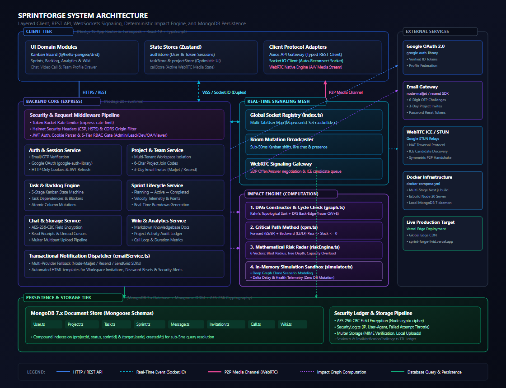
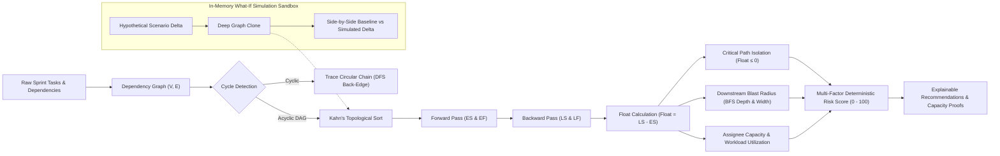
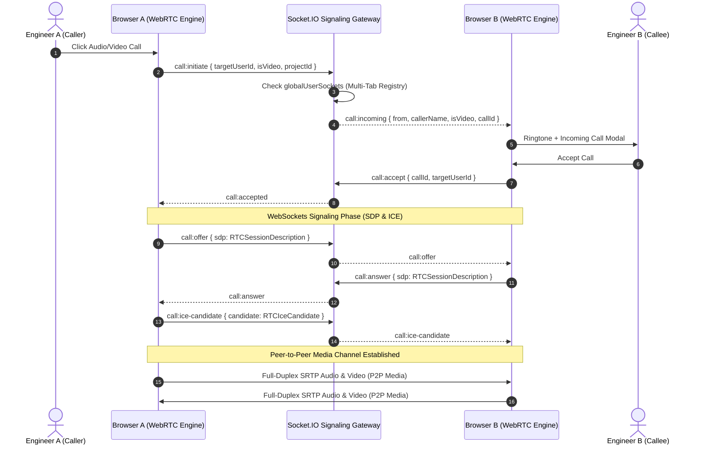

<div align="center">


# ⚡ SprintForge
### *Next-Generation Engineering Intelligence & Real-Time Agile Orchestration Platform*

> **"See how one change affects your sprint before you make it."**  
> A distributed, dependency-aware Agile orchestration platform combining real-time collaboration, WebRTC audio/video infrastructure, and deterministic engineering intelligence.

<br />

[](https://sprint-forge-livid.vercel.app/)
[](https://nextjs.org/)
[](https://www.typescriptlang.org/)
[](https://expressjs.com/)
[](https://webrtc.org/)
[](https://socket.io/)
[](https://www.mongodb.com/)
[](https://www.docker.com/)
[](LICENSE)

</div>

> [!TIP]
> ### 🚀 **Live Production Deployment is Online!**
> Explore real-time Kanban boards, DAG Impact Engine simulations, and WebRTC audio/video calling live in your browser:  
> **👉 [https://sprint-forge-livid.vercel.app/](https://sprint-forge-livid.vercel.app/)**

---

## 🏗️ System Architecture

SprintForge uses a modular client, API, realtime, intelligence, and persistence architecture designed around collaborative engineering workflows.

<div align="center">

[](https://sprint-forge-livid.vercel.app/)

<p><em>SprintForge System Architecture: Client Tier, Express Backend Services, Socket.IO Realtime Mesh, Impact Computation Pipeline, and MongoDB Document Store.</em></p>

</div>

<br />

### 🔄 Core Data Flow

```
[ Engineer / User Action ]
          │
          ▼
[ Next.js 16 Client ]  (Optimistic Zustand state update)
          │
     ┌────┴───────────────────────────────┐
     │                                    │
(HTTPS REST API)                 (Duplex WebSockets)
     │                                    │
     ▼                                    ▼
[ Express Backend Services ]     [ Socket.IO Signaling Mesh ]
     │                                    │
     ▼                                    │
[ MongoDB 7.x Database ]                  │
     │                                    │
     └─────────────────┬──────────────────┘
                       │
                       ▼
         [ Realtime Broadcast to Connected Clients ]
```

<br />

### 📞 Realtime Calling Architecture

```
[ Signaling Path ]
Client A ───( SDP Offer / ICE Candidate )───► Socket.IO Signaling Bridge ───► Client B
Client B ───( SDP Answer / ICE Candidate )──► Socket.IO Signaling Bridge ───► Client A

[ Media Path (Peer-to-Peer) ]
Client A ◄═══════════════ ( Full-Duplex SRTP Audio & Video Stream ) ═══════════════► Client B
```

- **Signaling Channel**: Transports SDP session descriptions and ICE candidate discoveries over Socket.IO room mesh.
- **Media Channel**: Direct browser-to-browser peer-to-peer SRTP audio and video streaming (zero server media relay overhead).

<br />

### 🧠 Impact Engine Computation Pipeline

```
[ Sprint Tasks & Dependencies Input ]
                  │
                  ▼
   [ Dependency Graph Construction ]
                  │
                  ▼
   [ Directed Acyclic Graph (DAG) ]
                  │
                  ▼
[ Cycle Detection: Kahn's Topo Sort & DFS Back-Edge Tracer O(V+E) ]
                  │
                  ▼
[ Critical Path Method (CPM): ES/EF Forward + LS/LF Backward Pass ]
                  │
                  ▼
[ Mathematical Risk Radar: 6-Vector Normalized Scoring (0 - 100) ]
                  │
                  ▼
[ In-Memory What-If Simulation: Deep Graph Clone Scenario Sandbox ]
                  │
                  ▼
[ Explainable Recommendations & Workload Rebalancing Telemetry ]
```

<br />

### 🔒 Authentication & Security Architecture

- **Identity & Federated Access**: Dual authentication via Cryptographic 6-digit Email OTP challenges and Google OAuth 2.0 PKCE (`google-auth-library`).
- **Session & Transport Security**: Secure HTTP-Only cookies with JWT rotation, Helmet security headers (strict CSP, HSTS), and token-bucket rate limiting (`express-rate-limit`).
- **Granular 5-Tier RBAC**: Enforces `Admin` > `Lead` > `Dev` > `QA` > `Viewer` access boundaries across workspace resources.
- **Data-at-Rest Cryptography**: AES-256-CBC field-level encryption for sensitive stored message payloads and audit logging (`SecurityLog.ts`).

---

## 🔬 Flagship Engineering Intelligence: The Impact Engine

Rather than relying on non-deterministic black-box LLMs, SprintForge includes a dedicated **Graph & Operations Research Engine** that performs deterministic, explainable schedule risk forecasting and in-memory what-if simulations.



### 1. Mathematical Algorithms & Formulations

#### Critical Path Method (CPM)
For any task $v \in V$ with duration $D(v) = \frac{\text{EstimatedHours}(v)}{6}$:

- **Earliest Start ($ES$) & Earliest Finish ($EF$)** — Forward Pass:
  $$ES(v) = \max_{u \in \text{Pred}(v)} EF(u) \quad \text{where } ES(\text{root}) = 0$$
  $$EF(v) = ES(v) + D(v)$$

- **Latest Finish ($LF$) & Latest Start ($LS$)** — Backward Pass:
  $$LF(u) = \min_{w \in \text{Succ}(u)} LS(w) \quad \text{where } LF(\text{sink}) = T_{\max} = \max_{v \in V} EF(v)$$
  $$LS(u) = LF(u) - D(u)$$

- **Total Float (Slack)**:
  $$\text{Float}(u) = LS(u) - ES(u)$$
  $$\text{IsCritical}(u) \iff \text{Float}(u) \le 0$$

#### Deterministic Risk Score Function
Every task receives a normalized risk score $R(u) \in [0, 100]$ computed across 6 orthogonal vectors:
$$R(u) = \min\Big(100, \, S_{\text{critical}} + S_{\text{depth}} + S_{\text{blast}} + S_{\text{workload}} + S_{\text{deadline}} + S_{\text{blocker}}\Big)$$

| Risk Factor | Mathematical Formulation | Max Points |
|---|---|---|
| **Critical Path Bottleneck** | $S_{\text{critical}} = 30 \text{ if Float} \le 0 \text{ else } 0$ | 30 pts |
| **Propagation Depth** | $S_{\text{depth}} = \min(20, \text{Depth}_{\text{downstream}} \times 6.5)$ | 20 pts |
| **Downstream Blast Radius** | $S_{\text{blast}} = \min(20, |\text{DownstreamTasks}| \times 4.0)$ | 20 pts |
| **Assignee Workload Overload** | $S_{\text{workload}} = 15 \text{ if } \frac{\text{AssignedHours}}{\text{SprintCapacity}} > 1.15 \text{ else } 10 \text{ if } > 0.85$ | 15 pts |
| **Schedule Proximity** | $S_{\text{deadline}} = 15 \text{ if Overdue, } 10 \text{ if Due in } \le 2\text{d}$ | 15 pts |
| **Active Blocker State** | $S_{\text{blocker}} = 15 \text{ if IsBlocked or any Predecessor is Blocked}$ | 15 pts |

#### In-Memory What-If Simulation
Allows engineering managers and tech leads to test hypothetical scenarios (e.g. *What if task $X$ takes 3 more days?*, *What if we reassign task $Y$ to Alex?*, *What if a dependency is blocked?*) without mutating live database records:
$$\Delta_{\text{Health}} = \text{Health}_{\text{Simulated}} - \text{Health}_{\text{Baseline}}$$
$$\Delta_{\text{Delay}} = \text{ProjectedDelay}_{\text{Simulated}} - \text{ProjectedDelay}_{\text{Baseline}}$$

---

## 📞 Real-Time WebRTC Audio/Video Calling Engine

SprintForge includes a production-grade WebSockets + WebRTC signaling mesh supporting peer-to-peer audio and video communication with intelligent multi-tab presence arbitration.



### Signaling Architecture Highlights
- **Global User Socket Registry**: Maps each user ID to a `Set<socketId>` across multiple open tabs, enabling ringtone dispatch and synchronized dismissal across all client sessions when answered or declined elsewhere.
- **ICE Candidate Queueing**: Solves asynchronous race conditions where candidate exchange occurs before `setRemoteDescription` completes.
- **Graceful Fallbacks**: Audio/Video hardware mute states, dynamic screen sharing, and automatic call teardown on network disconnects.

---

## ⚡ Core Feature Matrix

```
┌──────────────────────────────────────────────────────────────────────────────────────────────────┐
│                                       SPRINTFORGE PLATFORM MATRIX                                │
├──────────────────────────────┬──────────────────────────────────┬────────────────────────────────┤
│ 🚀 Engineering Intelligence  │ ⚡ Real-Time Collaboration       │ 👥 Team & Workspace Operations │
├──────────────────────────────┼──────────────────────────────────┼────────────────────────────────┤
│ • Critical Path Method (CPM) │ • Live 5-Column Kanban Sync      │ • 360° Public Member Profiles  │
│ • Directed Dependency Graphs │ • WebRTC 1-on-1 Audio/Video Call │ • 5-Tier Granular RBAC Perms   │
│ • What-If Scenario Simulator │ • AES-256 Encrypted Group Chat   │ • 6-Character Project Join Code│
│ • Deterministic Risk Radar   │ • Collaborative Live Cursors     │ • 3-Day Secure Email Invites   │
│ • Explainable Rebalancing    │ • Typing Indicators & Presence   │ • Markdown Project Wiki / Docs │
│ • Burndown & Velocity Charts │ • Real-Time Notification Center  │ • Native-Free Dark DatePicker  │
└──────────────────────────────┴──────────────────────────────────┴────────────────────────────────┘
```

### 1. Kanban & Agile Workflow
- **Interactive Kanban**: 5 workflow stages (`To Do` → `In Progress` → `In Review` → `Blocked` → `Done`) with optimistic UI updates and live multi-user synchronization.
- **Backlog Grooming & Sprints**: Sprint lifecycles (Planning → Active → Completed), story point allocation, and automated burndown tracking.

### 2. Workspace Member Profiles
- Interactive sliding drawer exposing real-time member telemetry: online status, role badges, active task counts, project assignments, and direct one-click audio/video call triggers.

### 3. Enterprise Cryptography & Security
- **AES-256-CBC Encryption**: End-to-end field encryption for stored chat messages and sensitive project metadata.
- **5-Tier Permission RBAC**: Enforces `view`, `create`, `edit`, `delete`, and `manage` across all API route handlers and middleware layers.
- **Defense in Depth**: Integrated Helmet headers, MongoDB injection sanitization, token bucket rate limiters, and strict CORS origin validation.

---

## 💻 Tech Stack & Engineering Specifications

### Frontend Architecture
| Layer | Technologies | Architectural Rationale |
|---|---|---|
| **Framework** | Next.js 16 (App Router + Turbopack) | Server-side rendering, streaming SSR, optimal bundle splitting |
| **Language** | TypeScript 5.x (Strict) | Compile-time type safety across all domain models and API contracts |
| **State Management** | Zustand | Zero-boilerplate, slice-based reactive state with minimal re-renders |
| **Styling & Design** | TailwindCSS + Framer Motion | High-performance CSS transitions, spring physics, and fluid dark aesthetic |
| **Drag & Drop** | `@hello-pangea/dnd` | Accessible, 60fps virtualized drag-and-drop board mechanics |
| **Data Visualization** | Recharts + Custom SVG Canvas | Responsive vector rendering for Burndowns, Velocities, and DAG topologies |
| **Media & Protocols** | WebRTC + Socket.IO Client | Sub-50ms peer-to-peer audio/video streaming and duplex signaling |

### Backend Architecture
| Layer | Technologies | Architectural Rationale |
|---|---|---|
| **Runtime & Server** | Node.js 20+ & Express.js (TypeScript) | High-throughput asynchronous I/O event loop |
| **Compiler / Bundler** | `esbuild` | Sub-30ms production bundling to single standalone Node binary |
| **Database & ODM** | MongoDB 7+ with Mongoose | Flexible schema validation, compound indexing, and atomic updates |
| **Real-Time Gateway** | Socket.IO 4.x | WebSocket transport with fallback, room clustering, and presence |
| **Cryptography** | Node.js `crypto` (AES-256-CBC) | Hardware-accelerated cryptographic primitives for data at rest |
| **Email Infrastructure** | Mailjet API / SMTP Gateway | Transactional delivery for invitations, password resets, and verification |

---

## 📁 Repository Directory Hierarchy

```
SprintForge/
├── 📁 frontend/                         # Next.js 16 App Router (TypeScript)
│   ├── app/
│   │   ├── layout.tsx                  # Global root layout & font initialization
│   │   ├── page.tsx                    # Landing page & feature showcase
│   │   ├── login/ & signup/            # Auth flows
│   │   ├── invite/[token]/             # Email invite token resolver
│   │   └── dashboard/                  # Protected workspace routes
│   │       ├── layout.tsx              # Sidebar + Navbar layout shell
│   │       └── projects/[id]/
│   │           ├── board/              # 🗂 Real-time Kanban board
│   │           ├── impact/             # 🧠 Flagship Impact Engine & What-If Simulator
│   │           ├── backlog/            # 📑 Backlog management
│   │           ├── sprints/            # 🏃 Sprint orchestrator & burndown charts
│   │           ├── analytics/          # 📊 Project health & velocity telemetry
│   │           ├── chat/               # 💬 AES-256 encrypted real-time chat
│   │           ├── call/               # 📞 WebRTC audio/video calling suite
│   │           ├── team/               # 👥 Member management & public profile drawer
│   │           └── wiki/               # 📚 Markdown docs & wiki hierarchy
│   ├── components/
│   │   ├── impact/                     # DependencyGraphView, CriticalPathTimeline, RiskRadar, Simulator
│   │   ├── board/                      # Kanban board, TaskCard, TaskDetailModal
│   │   ├── team/                       # MemberProfileDrawer, MemberTable
│   │   └── shared/                     # Custom DatePicker, Sidebar, Navbar, UserAvatar
│   └── lib/
│       ├── api.ts                      # Fully typed Axios API gateway client
│       ├── socket.ts                   # Socket.IO client singleton with auto-reconnect
│       └── store/                      # Zustand state stores (auth, projects, calls, tasks)
│
├── 📁 backend/                          # Node.js + Express API Server (TypeScript)
│   ├── src/
│   │   ├── server.ts                   # Entry point, middleware pipeline, socket bootstrap
│   │   ├── models/                     # Mongoose schemas (Task, Project, Sprint, User, etc.)
│   │   ├── routes/                     # Express REST routes (impact, projects, tasks, calls, auth)
│   │   ├── services/
│   │   │   ├── impact/                 # 🧠 Graph, CPM, Risk, Simulator, & Recommendation engines
│   │   │   └── emailService.ts         # Transactional email dispatcher
│   │   ├── socket/                     # WebRTC signaling & global presence registry
│   │   ├── middleware/                 # Auth (JWT), RBAC (5 tiers), RateLimit, Sanitizer, ErrorHandler
│   │   ├── utils/                      # AES-256-CBC cipher utilities
│   │   └── tests/                      # Automated unit test suites (impactEngine.test.ts)
│   └── dist/                           # Compiled server distribution
│
├── docker-compose.yml                   # Containerized multi-service topology
└── README.md
```

---

## ⚡ Algorithmic Complexity & Benchmarks

| Component / Routine | Algorithm | Time Complexity | Space Complexity | Benchmark |
|---|---|---|---|---|
| **Topological Sort** | Kahn's Algorithm | $\mathcal{O}(V + E)$ | $\mathcal{O}(V)$ | $< 1.2\text{ms}$ for $1000$ tasks |
| **Cycle Detection** | DFS Back-Edge Search | $\mathcal{O}(V + E)$ | $\mathcal{O}(V)$ | $< 0.8\text{ms}$ for $1000$ tasks |
| **Critical Path (CPM)** | Forward / Backward Pass | $\mathcal{O}(V + E)$ | $\mathcal{O}(V)$ | $< 1.5\text{ms}$ for $1000$ tasks |
| **Blast Radius** | Breadth-First Search (BFS) | $\mathcal{O}(V + E)$ | $\mathcal{O}(V)$ | $< 0.5\text{ms}$ per query |
| **What-If Simulation** | In-Memory Graph Cloning + CPM | $\mathcal{O}(V + E)$ | $\mathcal{O}(V + E)$ | $< 2.8\text{ms}$ end-to-end |
| **Backend Production Build** | `esbuild` bundler | — | — | $25\text{ms}$ compilation time |

---

## 🚀 Quick Start Guide

### Prerequisites
- **Node.js**: `v20.x` or higher
- **MongoDB**: `v7.x` or MongoDB Atlas Cluster
- **Package Manager**: `npm` or `yarn`

### 1. Clone Repository
```bash
git clone https://github.com/dakshgupta-26/SprintForge.git
cd SprintForge
```

### 2. Backend Setup
```bash
cd backend

# Copy sample configuration
cp .env.example .env

# Install dependencies
npm install

# Run automated algorithmic test suites
npx tsx src/tests/impactEngine.test.ts

# Start development server with hot-reload
npm run dev
```

### 3. Frontend Setup
```bash
cd ../frontend

# Install dependencies
npm install

# Start Next.js Turbopack development server
npm run dev
```

---

## 🐳 Containerized Deployment (Docker Compose)

Launch the complete multi-tier stack (Frontend, Backend, and MongoDB) with container health checks:

```bash
# Build and spin up containers in detached mode
docker-compose up --build -d

# Check cluster logs
docker-compose logs -f
```

---

## 📡 Core API Reference Summary

### 🧠 Impact Engine
| Method | Endpoint | Description | Auth |
|---|---|---|---|
| `GET` | `/api/projects/:projectId/impact` | Calculates full CPM schedule, risk radar, and top recommendations | JWT Required |
| `POST` | `/api/projects/:projectId/impact/simulate` | Executes in-memory what-if scenario without database mutation | JWT Required |
| `GET` | `/api/projects/:projectId/impact/tasks/:taskId` | Retrieves task-specific downstream blast radius and upstream blockers | JWT Required |

### 📋 Agile Board & Sprints
| Method | Endpoint | Description | Auth |
|---|---|---|---|
| `GET` | `/api/tasks?project=:id` | Query tasks for a given project/sprint scope | JWT Required |
| `PUT` | `/api/tasks/:id/status` | Atomic Kanban column shift with live WebSocket broadcast | JWT Required |
| `GET` | `/api/sprints/:id/burndown` | Calculates real-time sprint burndown telemetry | JWT Required |

### 📞 WebRTC Audio & Video Calls
| Method | Endpoint | Description | Auth |
|---|---|---|---|
| `GET` | `/api/calls/project/:projectId` | Paginated project call history with durations and timestamps | JWT Required |
| `POST` | `/api/calls/:callId/end` | Gracefully closes call session and calculates duration metrics | JWT Required |

---

## 📄 License & Attribution

Distributed under the **MIT License**. See `LICENSE` for more information.

<div align="center">

**Crafted with engineering rigor by [Daksh Gupta](https://github.com/dakshgupta-26)**  
*Engineered for scale, speed, and deterministic intelligence.*

</div>
